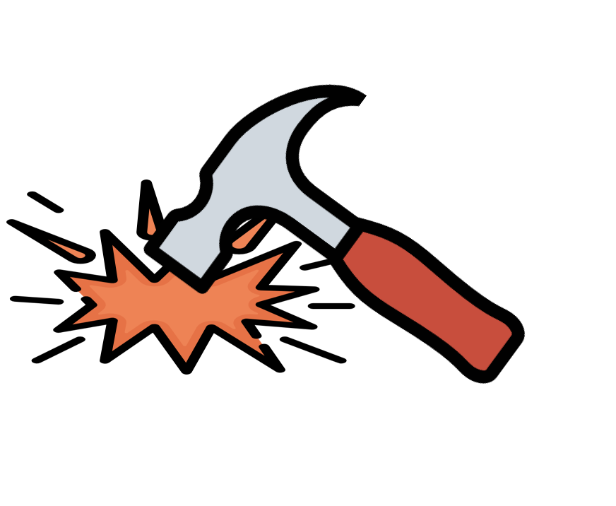

<p align="center">
    <a href="https://seonhyungjo.github.io/use-hammer/"></a>

<h1 align="center">React useHammer Hooks</h1>

<div align="center">

[](https://www.npmjs.com/package/use-hammer) [](https://standardjs.com)

</div>

## Install

```bash
npm install --save use-hammer
```

## Usage

```tsx
import React from 'react'
import useHammer from 'use-hammer'

const Example = () => {
  const onHammer = useCallback(() => {
    console.log('Long Press')
  }, [])

  const [hammerDown, hammerUp] = useHammer({onHammer, second:300})
  return (
    <div className={"sample-div"} onMouseDown={()=> hammerDown()} onMouseUp={() => hammerUp()}/>
  )
}
```

## API

### `useHammer`

| Prop | Type | Required | Description |
| :--- | :--- | :------: | :---------- |
| `onHammer` | Function |    ✓     | Execute onHammer Function |
| `second` | number | | [Default:700ms] Millisecond |

## License

MIT © [snyung](https://github.com/snyung)

---

This hook is created using [create-react-hook](https://github.com/hermanya/create-react-hook).
